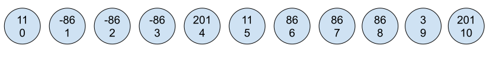
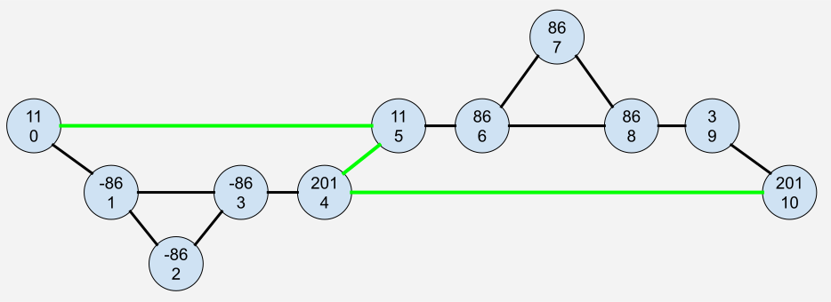
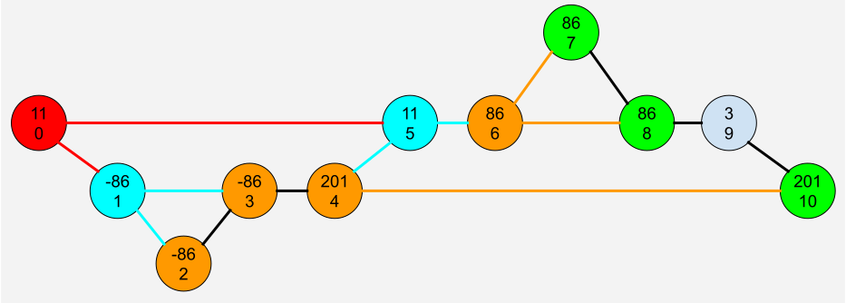

# Поиск наименьшего количества перемещений

**Задача**

Примерные условия задачи могут начинаться так:

На планете было несколько материков которые со временем распались на острова. Каждый остров назван номером своего материка к которому он раньше принадлежал.

Однажды эти острова выстроились в один ряд в случайном порядке. 

- Между островами с разными номерами можно перемещаться только последовательно от острова к острову в любую сторону.
- Между островами с одинаковыми номерами можно сразу прыгать минуя другие острова, стоящие на пути.

Нужно найти наименьшее количество перемещений с первого острова на последний.

На рисунке изображен числовой ряд островов. Вверху номера материков к которым принадлежал остров остров, внизу его порядковый номер в ряду.

Задача решается методом обхода графа в ширину BFS.

Все элементы ряда островов это вершины графа. Перемещаться можно между любыми соседними островами, значит все вершины последовательно соединяются ребрами. 

Так же все вершины с одинаковым номером соединяются между собой.

На рисунке ниже показно как должен соединяться выше указанный ряд. И сразу становится видно минимальное количество перемещений от начала к концу - зеленая линия.

### Описание алгоритма.

Кратко:

Делаем обход в ширину BFS от первого элемента. В этом алгоритме каждый проход называется волной. Как только очередная волна попадет в последний элемент, номер ее итерации и будет максимальным количеством перемещений.

Каждая вершина на которую упала волна, помечается посещенной. Если новая волна бьёт посещенную вершину, то ее дальнейшее движение заканчивается.

Более подробное описание.

На рисунке выше красный элемент 11(0) создает первую волну по красным ребрам и попадает в бирюзовые элементы -86(1) и 11(5).

Эти элементы создают вторую бирюзовую волну, которая попадает в коричневые элементы -86(2) -86(3) и 201(4) 86(6).

В этом месте новая волна от -86(2) ударит уже посещенную вершину -86(3).

А -86(3) напустит волну на уже посещенную 201(4). 

Это значит движение от узлов -86 прекращается.

Узел 201(4) запускает волну в конечный пункт 201(10). Приплыли. Три волны - три прыжка.

Движение от узла 86(6) уже не требуется. 